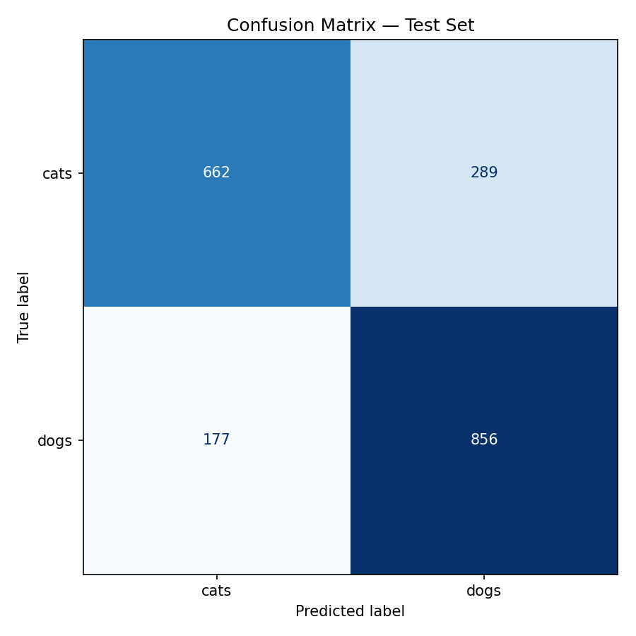
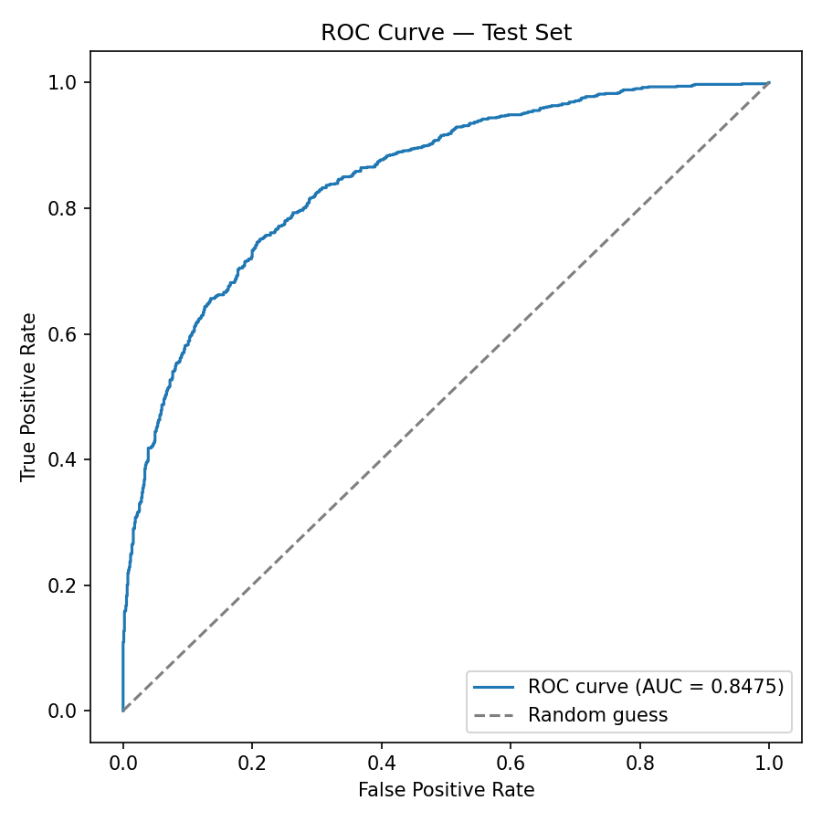
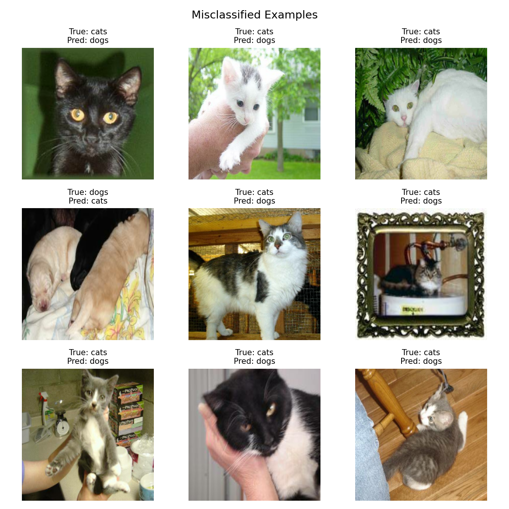
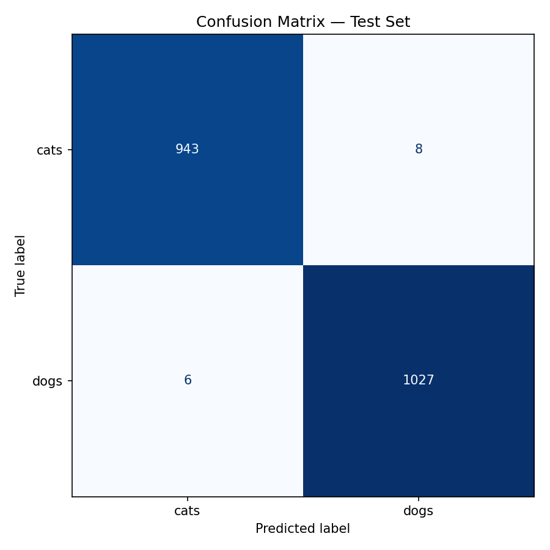
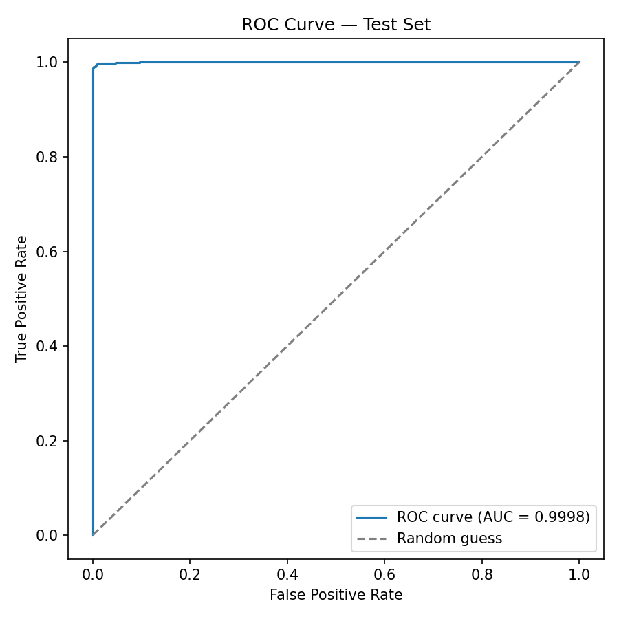
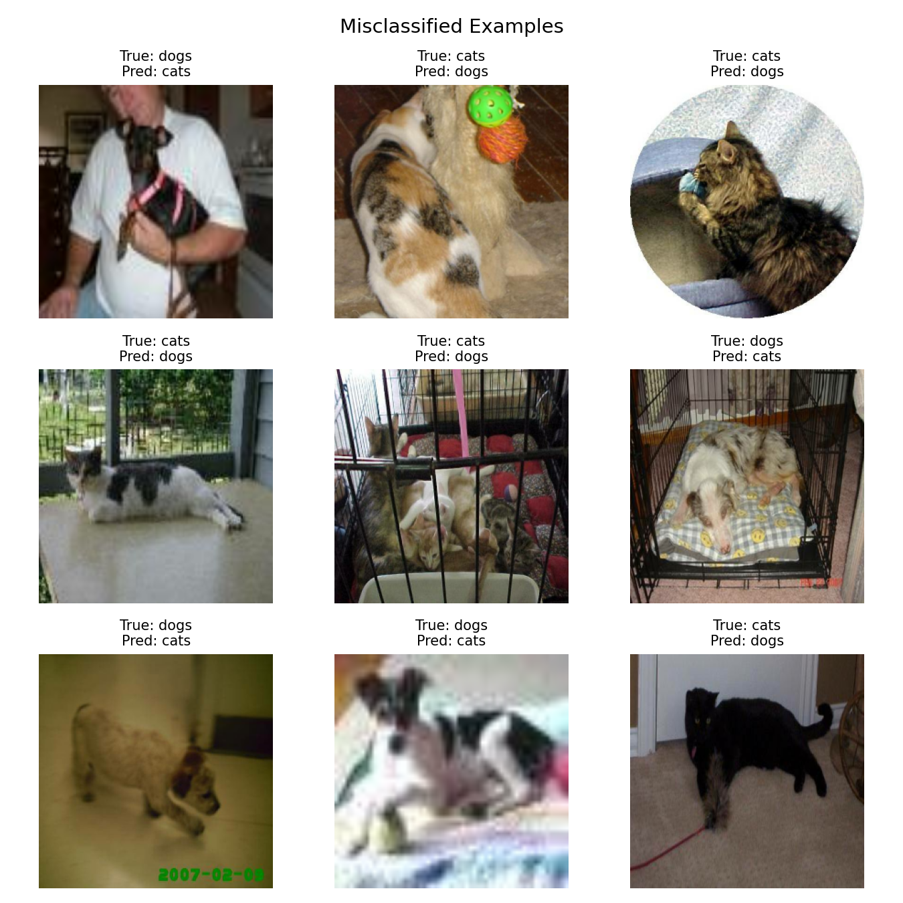

# Cats vs Dogs Classifier

An image classification project upgraded from a single notebook into a
reproducible ML pipeline with data augmentation, transfer learning,
Docker-based serving, and CI.

> This README is updated as each phase is completed. Currently covers
> through Phase 3.

## Project status

- [x] Phase 0 — Repo structure, config, data download script
- [x] Phase 1 — Data pipeline & augmentation
- [x] Phase 2 — Model: baseline CNN + MobileNetV2 transfer learning
- [x] Phase 3 — Evaluation
- [ ] Phase 4 — Inference packaging
- [ ] Phase 5 — Serving API
- [ ] Phase 6 — Docker
- [ ] Phase 7 — CI/CD
- [ ] Phase 8 — Documentation & polish

## Setup

1. Clone the repo and create a virtual environment:
   ```bash
   python3 -m venv .venv
   source .venv/bin/activate      # on Windows: .venv\Scripts\activate
   pip install -r requirements.txt
   ```

2. Get a Kaggle API token: go to kaggle.com/settings -> API ->
   "Create New Token". This gives you a single token string
   (format: `KGAT_...`).

3. Set it as an environment variable (never commit this token):
   ```bash
   export KAGGLE_API_TOKEN=KGAT_your_token_here     # Windows: set KAGGLE_API_TOKEN=...
   ```
   If you generated an older "Legacy API Key" instead, set
   `KAGGLE_USERNAME` and `KAGGLE_KEY` instead — the download script
   supports both.

4. Download and extract the dataset:
   ```bash
   python src/data/download.py
   ```
   This will populate `data/raw/train` and `data/raw/test`.

5. All hyperparameters and paths live in `configs/config.yaml` — edit
   that file to change image size, batch size, epochs, or which model
   architecture to use, rather than editing source code.

## Data pipeline (Phase 1)

`src/data/preprocess.py` builds train/validation/test `tf.data`
pipelines from `data/raw/train`, splitting off a held-out test set
that is never used for training or hyperparameter tuning — only for
final evaluation. Augmentation (random flip, rotation, zoom, contrast)
is defined here but applied inside the model itself (see Phase 2),
so it's automatically active during training and inactive during
evaluation/inference.

Run it standalone to sanity-check the pipeline:
```bash
python src/data/preprocess.py
```

## Models (Phase 2)

Two architectures are available, controlled by `model.architecture`
in `configs/config.yaml`:

- `baseline_cnn` — a 3-block CNN trained from scratch. Serves as the
  comparison baseline.
- `mobilenetv2` — a MobileNetV2 backbone pretrained on ImageNet, with
  a new classification head. Trained in two stages: first the head
  alone (base frozen), then fine-tuned by unfreezing the top ~30
  layers at a much lower learning rate.

Train either one with:
```bash
python -m src.models.train
```

Each run saves the best checkpoint to `model/<architecture>-<version>.keras`
and appends its config + final test/validation accuracy to
`logs/runs.json`, so results from both architectures can be compared
side by side.

| Architecture | Val Accuracy | Test Accuracy | Test AUC |
|---|---|---|---|
| baseline_cnn | — | 77% | 0.8475 |
| mobilenetv2 | — | 99% | 0.9998 |

**Baseline CNN — Phase 3 result (after bug fix + full training):**
An earlier training run had a bug (see git history / commit notes) where
images were being normalized twice — once in the data pipeline and
again inside the model — which pushed pixel values so close to zero
that the model couldn't learn at all (48% accuracy, chance level).
After removing the duplicate rescaling layer and training for a full
20 epochs instead of 5, `baseline_cnn` reaches **77% test accuracy**
with an AUC of 0.8475 (precision/recall/F1 ≈ 0.75–0.79 across both
classes — see `logs/evaluation/baseline_cnn-v1/classification_report.txt`).

<p align="center">
  
  
  
</p>

**MobileNetV2 — Phase 3 result:** reaches **99% test accuracy** with
an AUC of 0.9998 and 0.99 precision/recall/F1 on both classes (see
`logs/evaluation/mobilenetv2-v1/classification_report.txt`). This
gap over the baseline is expected and is the core point of the
comparison: MobileNetV2 starts from ImageNet-pretrained features
(edges, textures, shapes learned from 1.4M images) and only needs to
adapt them to cats vs dogs, while `baseline_cnn` has to learn all of
that from scratch using ~16k training images — a much harder task
that plateaus at a meaningfully lower ceiling given the same training
budget.

<p align="center">
  
  
  
</p>

### Evaluation artifacts

Running `python -m src.evaluate --model <path>` produces, per model,
a confusion matrix, ROC curve, classification report, and a grid of
misclassified examples, saved under `logs/evaluation/<model-name>/`:

```bash
python -m src.evaluate --model model/baseline_cnn-v1.keras
python -m src.evaluate --model model/mobilenetv2-v1.keras
```

## Project structure

```
cats-vs-dogs/
├── data/                  # gitignored — populated by download.py
├── notebooks/             # exploratory work only
├── src/
│   ├── data/
│   │   ├── download.py     # Kaggle dataset download (Phase 0)
│   │   └── preprocess.py   # tf.data pipeline + augmentation (Phase 1)
│   ├── models/
│   │   ├── model.py         # baseline CNN + transfer learning architectures (Phase 2)
│   │   └── train.py         # training loop, callbacks, run logging (Phase 2)
│   └── evaluate.py         # confusion matrix, ROC-AUC, misclassified examples (Phase 3)
├── docs/images/           # evaluation images embedded in this README (committed, not gitignored)
├── app/                   # FastAPI serving app (Phase 5)
├── frontend/              # Streamlit/Gradio demo (Phase 6)
├── model/                 # saved model artifacts (gitignored)
├── logs/                  # run logs (gitignored)
├── tests/                 # unit tests (Phase 4)
├── configs/config.yaml    # all hyperparameters and paths
├── requirements.txt
└── .gitignore
```
